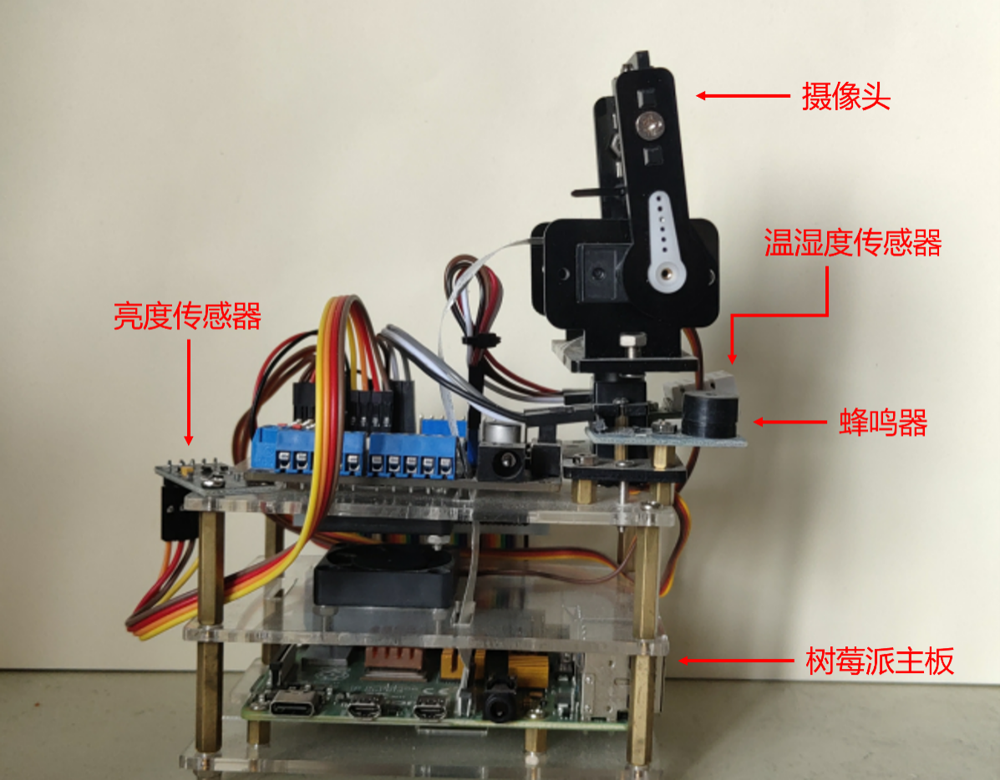
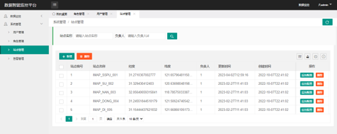
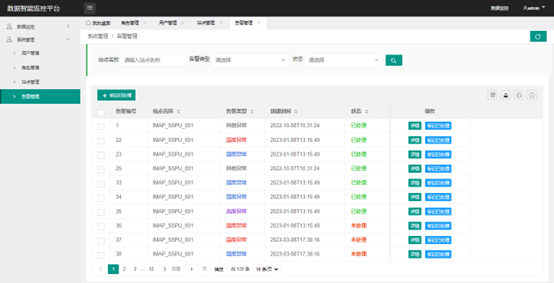
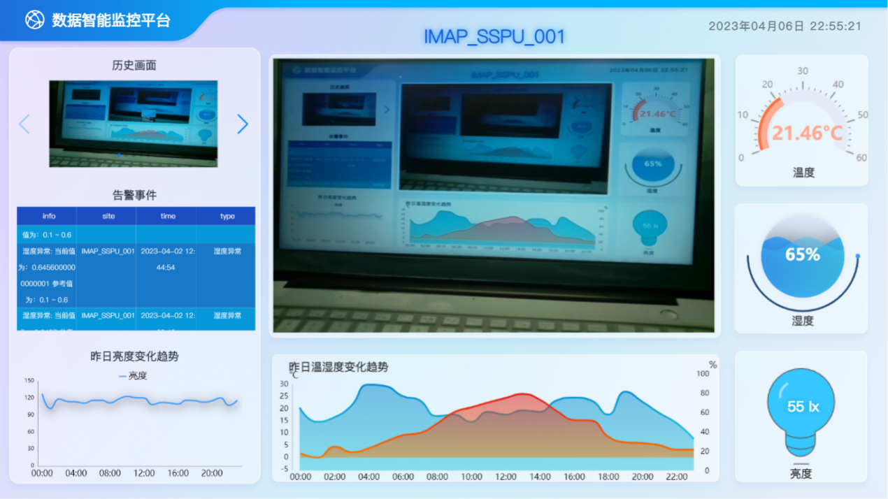
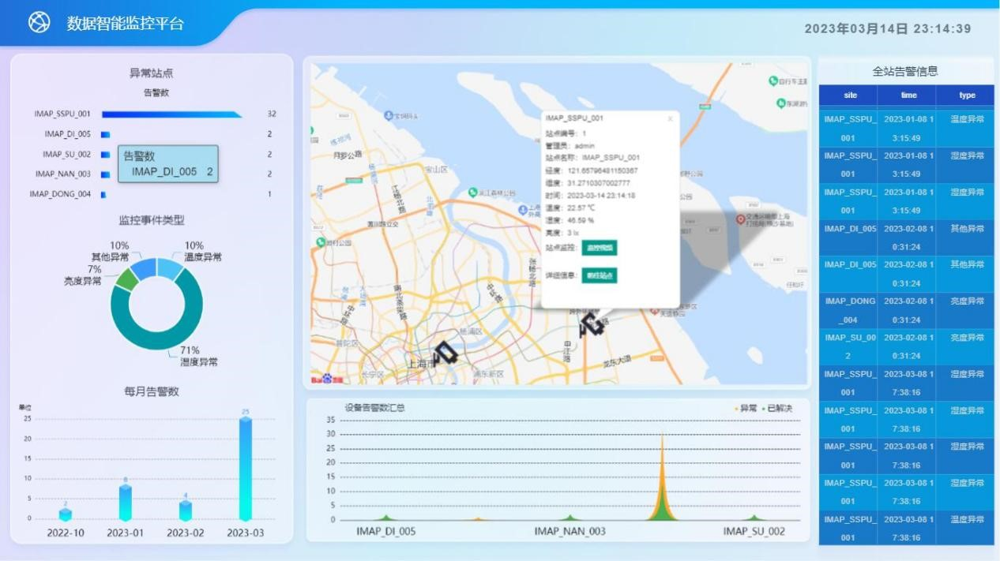
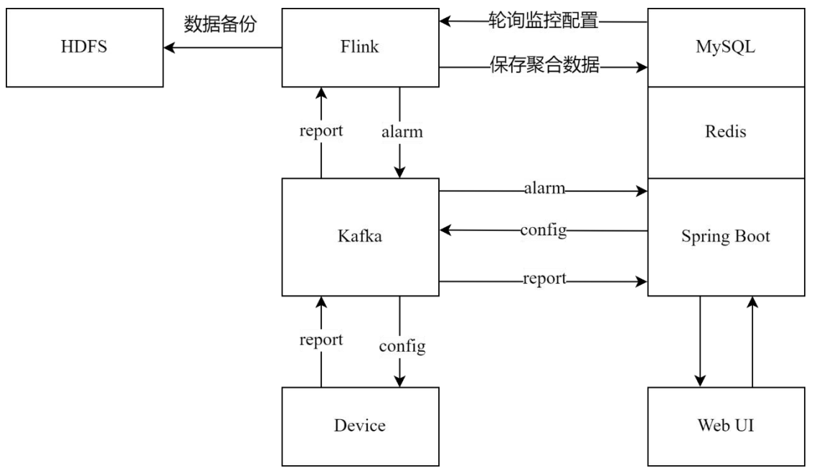

# 🚀 基于Flink的多源数据智能监控与分析平台

    

## 🌟 项目概述

在物联网（IoT）时代，每天都有海量的监控数据从各种设备中产生。如何高效地利用这些工业大数据，并以直观的方式揭示其内在规律，已经成为许多物联网公司亟待解决的关键问题。

本项目设计并实现了一个**基于Flink的多源数据智能监控与分析平台**，旨在为物联网企业提供一站式的解决方案。该平台支持多设备的数据采集、实时处理、存储管理以及可视化展示，助力企业快速洞察数据价值。

---

## 🔧 主要功能模块

### 数据采集
通过树莓派等硬件搭载各类传感器，实时采集环境数据（如温度、湿度、光照等），为后续分析提供基础数据支持。

  

### 数据处理
采用**Apache Flink**框架进行流批一体化处理，支持实时计算和离线分析，满足多样化的业务需求。

### 数据存储
- **MySQL**：用于存储用户、角色、站点等业务数据。
- **Redis**：作为缓存层，加速热点数据的访问。
- **HDFS**：存储大规模监控数据，保障数据的高可靠性和扩展性。

### 数据管理
提供完善的后台管理系统，支持用户权限管理、站点配置、告警规则设置等功能。

    
  

### 数据展示
基于**ECharts**和**Layui**技术，构建了直观、动态的数据可视化界面，帮助管理人员轻松分析和监控数据。

    
  

---

## 🛠 技术栈

| 模块       | 技术工具/框架                |
| ---------- | ---------------------------- |
| 数据采集   | Kafka, Python,  Raspberry Pi |
| 计算框架   | Apache Flink 1.13            |
| 数据存储   | HDFS, MySQL, Redis           |
| 后端开发   | Java 8, Spring Boot 2.6.2    |
| 数据可视化 | ECharts 5.3.0, Layui         |

---

## 📊 系统数据流图

以下为系统的整体数据流架构图，展示了从数据采集到展示的完整流程：

  

---

## 💻 开发环境

- **数据采集设备**：Python + Raspberry Pi  
- **大数据组件**：Kafka 2.4.1, Hadoop 3.1.3, Flink 1.13  
- **平台后端**：Java 8 + Spring Boot 2.6.2  
- **平台前端**：HTML, CSS, JavaScript, ECharts 5.3.0  

---

## 🌐 项目地址

本项目分为云、边、端三个部分，分别对应不同的功能模块：

- **云端**（数据计算与分析）：[GitHub - imap-flink](https://github.com/MarigWeizhi/imap-flink)  
- **边缘端**（数据采集与告警）：[GitHub - imap-pi](https://github.com/MarigWeizhi/imap-pi)  
- **终端**（前端展示与管理）：[GitHub- imap-web](https://github.com/MarigWeizhi/imap-web)  

---

## 📜 License

本项目采用 [MIT License](LICENSE)，您可以自由使用、修改和分发代码，但请保留原始版权声明。

---

### 🌟 Star & Fork

如果您觉得本项目对您有帮助，请不要吝啬您的 **Star** 和 **Fork**！这将是对我最大的支持！✨