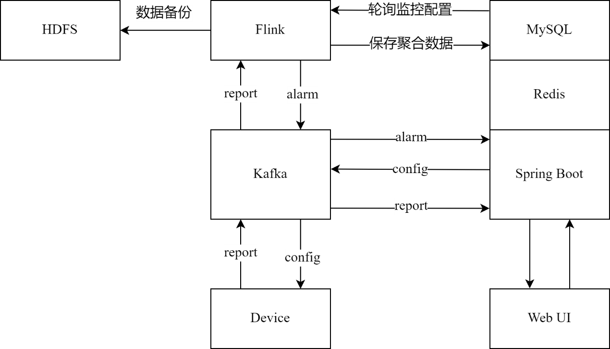

# 项目简介

基于云边端架构的数据监控系统，包含物联网设备开发、Kafka+Flink数据监控、Java后端+数据可视化大屏（jsp前端，历史遗留问题没做前后端分离）

## 项目架构

## 物联网设备

## web页面

## 可视化大屏

# 项目地址

云：https://gitee.com/Marig_Weizhi/imap-flink  
边：https://gitee.com/Marig_Weizhi/imap-pi
端：https://gitee.com/Marig_Weizhi/imap-web